# 🔥 REAL AGENT VAULT CREATION - PRODUCTION MAINNET

## 🚨 **CRITICAL: REAL MONEY VAULT CREATION**

**Date**: 2025-01-18  
**Status**: **READY FOR REAL ADA DEPOSITS**  
**Network**: **Cardano Mainnet**  
**Contract**: `addr1wxwx5rmqrwm4mpeg5ky6rt6lq76errkjjs490pewl9rqvrcqzrec7`

---

## 💰 **REAL VAULT CREATION PROCESS**

### **Step 1: Prepare REAL ADA**
- **Minimum Deposit**: 60 REAL ADA
- **Recommended**: 75-100 REAL ADA
- **Maximum**: 200 REAL ADA (for testing)
- **Network**: Cardano Mainnet (NOT testnet)
- **Wallet**: Nami, Eternl, or compatible

### **Step 2: Access MISTER Trading Page**
```bash
# Navigate to production frontend
https://localhost:3000/trading
# OR production deployment URL when available
```

### **Step 3: Create REAL Agent Vault**
1. **Connect Wallet**: Click "Connect Wallet" → Select your wallet
2. **Verify Network**: Ensure Cardano mainnet (NOT testnet)
3. **Click "Create Agent Vault"**: Red button (indicates REAL money)
4. **Set Parameters**:
   - Initial Deposit: 75 REAL ADA
   - Max Trade Amount: 25 REAL ADA
   - Trading Enabled: ✅ YES
5. **Send REAL ADA**: Use wallet SEND function to production contract

---

## 🎯 **REAL VAULT CONFIGURATION**

### **Production Contract Details**
```typescript
const REAL_VAULT_CONFIG = {
  contractAddress: "addr1wxwx5rmqrwm4mpeg5ky6rt6lq76errkjjs490pewl9rqvrcqzrec7",
  network: "mainnet",
  environment: "PRODUCTION",
  realFunds: true,
  testMode: false
};
```

### **Vault Parameters**
- **Owner**: Your wallet's verification key hash
- **Created At**: Block timestamp
- **Trading Enabled**: True (allows automated trading)
- **Emergency Stop**: False (trading active)
- **Max Trade Amount**: 25 ADA (25% of 100 ADA vault)
- **Trade Count**: 0 (initial)

---

## 🔧 **REAL VAULT VERIFICATION**

### **Blockchain Verification**
```bash
# Check vault exists on Cardano mainnet
curl "https://cardano-mainnet.blockfrost.io/api/v0/addresses/addr1wxwx5rmqrwm4mpeg5ky6rt6lq76errkjjs490pewl9rqvrcqzrec7/utxos" \
  -H "project_id: mainnetKDR7gGfvHy85Mqr4nYtfjoXq7fX8R1Bu"
```

### **Expected Response**
```json
[
  {
    "tx_hash": "abc123...",
    "output_index": 0,
    "amount": [
      {
        "unit": "lovelace",
        "quantity": "75000000"  // 75 ADA in lovelace
      }
    ],
    "data_hash": "def456...",  // Vault datum hash
    "inline_datum": "...",     // Vault configuration
    "script_ref": null
  }
]
```

---

## 🤖 **AUTOMATED TRADING ACTIVATION**

### **Algorithm Integration**
Once vault is created with REAL ADA:

1. **ADA Custom Algorithm** monitors market every 5 minutes
2. **Real-time Analysis** using Railway service
3. **Signal Generation** when confidence ≥75%
4. **Automated Execution** through Agent Vault
5. **Real Strike Finance** positions opened with REAL ADA

### **Trading Flow**

```mermaid
graph TD
    A[REAL ADA Deposited] --> B[Vault Created on Mainnet]
    B --> C[Algorithm Monitors Market]
    C --> D{Confidence ≥75%?}
    D -->|YES| E[Execute REAL Trade]
    D -->|NO| F[Continue Monitoring]
    E --> G[REAL Strike Finance Position]
    G --> H[Track REAL P&L]
    H --> I[Auto Close on Stop/Profit]
    I --> C
    F --> C
```


---

## 📊 **REAL VAULT MONITORING**

### **Balance Tracking**
- **Initial Balance**: 75 REAL ADA
- **Available for Trading**: 50 REAL ADA (after reserves)
- **Max Single Trade**: 25 REAL ADA
- **Current Positions**: 0 (initially)

### **Performance Metrics**
- **Total Trades**: 0 (initially)
- **Win Rate**: N/A (no trades yet)
- **Total P&L**: 0 ADA (initially)
- **Current Value**: 75 ADA (initial deposit)

---

## 🚨 **REAL MONEY SAFETY MEASURES**

### **User Controls**
- ✅ **Emergency Stop**: User can halt all trading
- ✅ **Withdraw Funds**: User can withdraw REAL ADA anytime
- ✅ **Trading Limits**: Maximum 25 ADA per trade
- ✅ **Algorithm Override**: User can disable automated trading

### **Risk Management**
- 🛡️ **Stop Loss**: 4% automatic stop loss
- 🎯 **Take Profit**: 8% automatic take profit
- 📊 **Position Sizing**: Max 25% of vault per trade
- ⏰ **Time Limits**: Positions auto-close after 4 hours

---

## 🎯 **TESTING PROTOCOL**

### **Phase 1: Vault Creation (75 ADA)**
```bash
# 1. Create vault with 75 REAL ADA
# 2. Verify blockchain confirmation
# 3. Check frontend displays correct balance
# 4. Confirm vault status shows "Active"
```

### **Phase 2: Algorithm Integration (Wait for Signal)**
```bash
# 1. Monitor ADA Custom Algorithm for ≥75% confidence
# 2. Verify algorithm connects to vault
# 3. Wait for first automated trade signal
# 4. Confirm trade execution with REAL ADA
```

### **Phase 3: Trading Validation (Monitor Positions)**
```bash
# 1. Track REAL Strike Finance position
# 2. Monitor REAL P&L changes
# 3. Verify stop-loss and take-profit triggers
# 4. Confirm position closes automatically
```

### **Phase 4: User Withdrawal (Test Fund Recovery)**
```bash
# 1. Test user withdrawal of remaining REAL ADA
# 2. Verify user signature validation
# 3. Confirm REAL ADA returns to user wallet
# 4. Check vault balance updates correctly
```

---

## 📈 **EXPECTED OUTCOMES**

### **Successful Vault Creation**
- ✅ 75 REAL ADA locked in production contract
- ✅ Vault appears on Cardano mainnet
- ✅ Frontend shows correct balance and status
- ✅ Algorithm begins monitoring for signals

### **Automated Trading**
- 🎯 First trade within 24-48 hours (market dependent)
- 📊 Trade size: 20-25 REAL ADA
- 🔄 Position duration: 2-6 hours average
- 💰 Expected profit: 2-8% per successful trade

### **Risk Scenarios**
- ⚠️ **Market Volatility**: Algorithm may hold longer in uncertain conditions
- 🛑 **Low Confidence**: No trades if confidence <75%
- 📉 **Stop Loss**: 4% loss triggers automatic position close
- 🚨 **Emergency**: User can stop trading and withdraw funds anytime

---

## 🔗 **PRODUCTION ENDPOINTS**

### **Frontend Access**
- **Local Development**: `http://localhost:3000/trading`
- **Production URL**: TBD (when deployed)

### **API Endpoints**
- **Vault Balance**: Blockfrost API query
- **Algorithm Signals**: Railway service
- **Strike Finance**: Production API
- **Transaction Status**: Cardano mainnet explorer

---

## 📝 **REAL VAULT CREATION CHECKLIST**

### **Pre-Creation**
- [ ] Wallet has 80+ ADA (75 for vault + 5 for fees)
- [ ] Connected to Cardano mainnet
- [ ] Production contract address verified
- [ ] Frontend shows REAL money warnings

### **During Creation**
- [ ] Vault parameters set correctly
- [ ] REAL ADA sent to production contract
- [ ] Transaction confirmed on blockchain
- [ ] Frontend updates with new vault

### **Post-Creation**
- [ ] Vault balance shows 75 REAL ADA
- [ ] Algorithm begins monitoring
- [ ] Trading status shows "Active"
- [ ] User can access withdrawal interface

---

**🎯 BOTTOM LINE**: This creates a REAL Agent Vault with REAL ADA on Cardano mainnet. The vault will execute REAL trades using the validated ADA Custom Algorithm. Every transaction uses REAL money, every trade affects REAL balances, and every profit/loss is REAL. This is production-ready automated trading with actual funds! 🔥💰📈**
