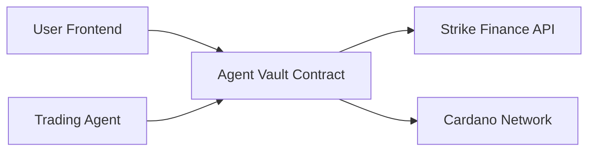

# Agent Vault Integration Guide

> **Complete integration guide for Strike Finance Agent Vault system**

This guide shows how to integrate the Agent Vault smart contract with your existing Strike Finance trading system.

## 🎯 Integration Overview

The Agent Vault replaces the managed wallet approach with a secure smart contract system:



### Before vs After

| Aspect | Managed Wallets | Agent Vault |
|--------|----------------|-------------|
| **Security** | Store seed phrases | No private keys |
| **User Control** | Limited | Full control |
| **Automation** | Full | Full |
| **Trust Model** | Trust service | Trust smart contract |

## 🔧 Step 1: Contract Deployment

### 1.1 Discover Strike Finance Contracts

First, we need to find the actual Strike Finance contract addresses:

```bash
cd strikeintegrationdocs/STRIKEDOCSFROMDEV/AIKEN\ DOCS/
npm install
npm run discover:contracts
```

This will analyze:
- Successful Strike Finance transactions
- Strike Finance API CBOR responses
- Cardano explorer data
- Documentation examples

### 1.2 Deploy Agent Vault

```bash
# Deploy to testnet first
npm run deploy:testnet

# After testing, deploy to mainnet
npm run deploy:mainnet
```

The deployment script will:
1. Compile the Aiken contract
2. Generate contract addresses
3. Update contract with real Strike Finance addresses
4. Deploy reference script to network
5. Save deployment information

## 🏗️ Step 2: Frontend Integration

### 2.1 Replace Managed Wallet Components

Update your frontend to use Agent Vault instead of managed wallets:

```typescript
// OLD: Managed wallet creation
const createManagedWallet = async () => {
  // This stored seed phrases - INSECURE
  const wallet = generateWallet();
  await saveWalletToDatabase(wallet.seedPhrase);
};

// NEW: Agent Vault creation
const createAgentVault = async (userWallet: WalletApi) => {
  const vaultDatum = {
    owner: await getUserVkh(userWallet),
    created_at: Date.now(),
    trading_enabled: true,
    emergency_stop: false,
    max_trade_amount: 50000000000, // 50,000 ADA
    trade_count: 0
  };
  
  const tx = await buildVaultCreationTx(vaultDatum, userWallet);
  const signedTx = await userWallet.signTx(tx);
  return await userWallet.submitTx(signedTx);
};
```

### 2.2 Update Trading Interface

Modify your trading components to work with Agent Vault:

```typescript
// components/AgentVaultTrading.tsx
import React, { useState, useEffect } from 'react';

interface AgentVaultProps {
  userWallet: WalletApi;
  vaultAddress: string;
}

export const AgentVaultTrading: React.FC<AgentVaultProps> = ({
  userWallet,
  vaultAddress
}) => {
  const [vaultStatus, setVaultStatus] = useState<VaultStatus>();
  const [tradingEnabled, setTradingEnabled] = useState(true);
  
  // Monitor vault status
  useEffect(() => {
    const monitorVault = async () => {
      const status = await getVaultStatus(vaultAddress);
      setVaultStatus(status);
      setTradingEnabled(status.trading_enabled && !status.emergency_stop);
    };
    
    monitorVault();
    const interval = setInterval(monitorVault, 10000); // Check every 10s
    return () => clearInterval(interval);
  }, [vaultAddress]);
  
  const handleEmergencyStop = async () => {
    const redeemer = { UserEmergencyStop: {} };
    const tx = await buildVaultTx(vaultAddress, redeemer, userWallet);
    const signedTx = await userWallet.signTx(tx);
    await userWallet.submitTx(signedTx);
  };
  
  const handleWithdraw = async (amount: number) => {
    const redeemer = { 
      UserWithdraw: { withdrawal_amount: amount * 1000000 } // Convert to lovelace
    };
    const tx = await buildVaultTx(vaultAddress, redeemer, userWallet);
    const signedTx = await userWallet.signTx(tx);
    await userWallet.submitTx(signedTx);
  };
  
  const toggleTrading = async () => {
    const redeemer = { 
      UserToggleTrading: { enable: !tradingEnabled }
    };
    const tx = await buildVaultTx(vaultAddress, redeemer, userWallet);
    const signedTx = await userWallet.signTx(tx);
    await userWallet.submitTx(signedTx);
  };
  
  return (
    <div className="agent-vault-trading">
      <div className="vault-status">
        <h3>Agent Vault Status</h3>
        <p>Balance: {vaultStatus?.balance} ADA</p>
        <p>Trading: {tradingEnabled ? '✅ Enabled' : '❌ Disabled'}</p>
        <p>Trades: {vaultStatus?.trade_count}</p>
      </div>
      
      <div className="vault-controls">
        <button onClick={toggleTrading}>
          {tradingEnabled ? 'Disable Trading' : 'Enable Trading'}
        </button>
        <button onClick={handleEmergencyStop} className="emergency">
          Emergency Stop
        </button>
        <button onClick={() => handleWithdraw(1000)}>
          Withdraw 1000 ADA
        </button>
      </div>
      
      <div className="trading-interface">
        {tradingEnabled ? (
          <AutomatedTradingPanel vaultAddress={vaultAddress} />
        ) : (
          <p>Automated trading is disabled</p>
        )}
      </div>
    </div>
  );
};
```

### 2.3 Update Trading Agent Integration

Modify your trading agent to work with Agent Vault:

```typescript
// lib/agentVaultTrading.ts
export class AgentVaultTrader {
  private agentWallet: CardanoWallet;
  private vaultContract: AgentVaultContract;
  
  constructor(agentWallet: CardanoWallet) {
    this.agentWallet = agentWallet;
    this.vaultContract = new AgentVaultContract();
  }
  
  async executeAutomatedTrade(
    vaultAddress: string,
    tradeParams: TradeParams
  ): Promise<string> {
    // 1. Validate vault allows trading
    const vaultStatus = await this.getVaultStatus(vaultAddress);
    if (!vaultStatus.trading_enabled || vaultStatus.emergency_stop) {
      throw new Error('Trading disabled for this vault');
    }
    
    // 2. Check trade amount limits
    if (tradeParams.amount > vaultStatus.max_trade_amount) {
      throw new Error('Trade amount exceeds vault limit');
    }
    
    // 3. Get Strike Finance CBOR
    const strikeResponse = await this.callStrikeFinanceAPI(tradeParams);
    const { cbor } = strikeResponse;
    
    // 4. Build Agent Vault transaction
    const redeemer = {
      AgentTrade: {
        trade_amount: tradeParams.amount,
        destination_contract: this.getStrikeContractHash(tradeParams.action)
      }
    };
    
    // 5. Combine with Strike Finance transaction
    const vaultTx = await this.buildVaultTransaction(
      vaultAddress,
      redeemer,
      cbor
    );
    
    // 6. Sign with agent wallet
    const signedTx = await this.agentWallet.signTx(vaultTx);
    
    // 7. Submit to network
    const txHash = await this.agentWallet.submitTx(signedTx);
    
    console.log(`✅ Agent Vault trade executed: ${txHash}`);
    return txHash;
  }
  
  private async buildVaultTransaction(
    vaultAddress: string,
    redeemer: AgentTradeRedeemer,
    strikeCbor: string
  ): Promise<string> {
    // Parse Strike Finance transaction
    const strikeTx = CSL.Transaction.from_bytes(Buffer.from(strikeCbor, 'hex'));
    
    // Build vault spending transaction
    const vaultTx = await this.vaultContract.buildSpendingTx({
      vaultUtxo: await this.findVaultUtxo(vaultAddress),
      redeemer,
      strikeOutputs: strikeTx.body().outputs(),
      agentWallet: this.agentWallet
    });
    
    return vaultTx;
  }
}
```

## 🔄 Step 3: Migration from Managed Wallets

### 3.1 Migration Strategy

For existing users with managed wallets:

```typescript
// Migration utility
export class ManagedWalletMigration {
  async migrateToAgentVault(
    userId: string,
    userWallet: WalletApi
  ): Promise<string> {
    // 1. Get managed wallet balance
    const managedWallet = await getManagedWallet(userId);
    const balance = await getWalletBalance(managedWallet.address);
    
    // 2. Create new Agent Vault
    const vaultAddress = await createAgentVault(userWallet);
    
    // 3. Transfer funds from managed wallet to vault
    const transferTx = await buildTransferTx(
      managedWallet,
      vaultAddress,
      balance
    );
    
    // 4. Sign with managed wallet (final use)
    const signedTx = await signWithManagedWallet(transferTx, managedWallet);
    const txHash = await submitTx(signedTx);
    
    // 5. Update user record
    await updateUserRecord(userId, {
      vaultAddress,
      managedWalletMigrated: true,
      migrationTxHash: txHash
    });
    
    // 6. Securely delete managed wallet
    await secureDeleteManagedWallet(managedWallet);
    
    return vaultAddress;
  }
}
```

### 3.2 Migration UI

```typescript
// components/MigrationWizard.tsx
export const MigrationWizard: React.FC = () => {
  const [step, setStep] = useState(1);
  const [migrationStatus, setMigrationStatus] = useState<MigrationStatus>();
  
  const steps = [
    { title: 'Connect Wallet', description: 'Connect your Cardano wallet' },
    { title: 'Create Vault', description: 'Deploy your personal Agent Vault' },
    { title: 'Transfer Funds', description: 'Move funds from managed wallet' },
    { title: 'Complete', description: 'Migration complete!' }
  ];
  
  return (
    <div className="migration-wizard">
      <h2>Migrate to Agent Vault</h2>
      <p>Upgrade to secure, non-custodial automated trading</p>
      
      <div className="migration-benefits">
        <div className="benefit">
          <h4>🔒 Enhanced Security</h4>
          <p>Your private keys never leave your wallet</p>
        </div>
        <div className="benefit">
          <h4>🎛️ Full Control</h4>
          <p>Enable/disable trading, withdraw anytime</p>
        </div>
        <div className="benefit">
          <h4>⚡ Same Automation</h4>
          <p>Keep all automated trading features</p>
        </div>
      </div>
      
      <MigrationSteps 
        currentStep={step}
        steps={steps}
        onComplete={handleMigrationComplete}
      />
    </div>
  );
};
```

## 🧪 Step 4: Testing Integration

### 4.1 Integration Test Suite

```bash
# Run full integration tests
npm run integration:test

# Test specific scenarios
npm run test:vault-creation
npm run test:automated-trading
npm run test:emergency-scenarios
```

### 4.2 Test Scenarios

1. **Vault Creation Flow**
   - User connects wallet
   - Creates Agent Vault
   - Deposits initial funds
   - Enables automated trading

2. **Automated Trading Flow**
   - Agent receives trading signal
   - Builds vault transaction
   - Executes Strike Finance trade
   - Verifies transaction success

3. **Emergency Scenarios**
   - User activates emergency stop
   - User withdraws all funds
   - Agent respects disabled trading

4. **Security Validation**
   - Unauthorized agent cannot trade
   - Invalid Strike contracts rejected
   - Trade limits enforced

## 📊 Step 5: Monitoring and Analytics

### 5.1 Vault Monitoring

```typescript
// lib/vaultMonitoring.ts
export class VaultMonitor {
  async getVaultMetrics(vaultAddress: string): Promise<VaultMetrics> {
    return {
      totalDeposits: await getTotalDeposits(vaultAddress),
      totalTrades: await getTotalTrades(vaultAddress),
      successRate: await getTradeSuccessRate(vaultAddress),
      averageTradeSize: await getAverageTradeSize(vaultAddress),
      lastActivity: await getLastActivity(vaultAddress),
      securityEvents: await getSecurityEvents(vaultAddress)
    };
  }
  
  async monitorVaultHealth(vaultAddress: string): Promise<HealthStatus> {
    const metrics = await this.getVaultMetrics(vaultAddress);
    
    return {
      status: this.calculateHealthStatus(metrics),
      alerts: this.generateAlerts(metrics),
      recommendations: this.generateRecommendations(metrics)
    };
  }
}
```

### 5.2 Dashboard Integration

Update your dashboard to show Agent Vault metrics:

```typescript
// components/VaultDashboard.tsx
export const VaultDashboard: React.FC = () => {
  const [vaults, setVaults] = useState<VaultInfo[]>([]);
  const [totalMetrics, setTotalMetrics] = useState<TotalMetrics>();
  
  return (
    <div className="vault-dashboard">
      <div className="metrics-overview">
        <MetricCard 
          title="Total Vaults" 
          value={vaults.length}
          trend="+12% this month"
        />
        <MetricCard 
          title="Total Value Locked" 
          value={`${totalMetrics?.tvl} ADA`}
          trend="+8% this week"
        />
        <MetricCard 
          title="Active Traders" 
          value={totalMetrics?.activeTraders}
          trend="+15% this month"
        />
      </div>
      
      <VaultList vaults={vaults} />
      <SecurityAlerts />
      <PerformanceCharts />
    </div>
  );
};
```

## 🚀 Step 6: Production Deployment

### 6.1 Pre-Production Checklist

- [ ] ✅ Contract security audit completed
- [ ] ✅ Integration tests passing
- [ ] ✅ Strike Finance contract addresses verified
- [ ] ✅ Agent wallet configured and funded
- [ ] ✅ Monitoring systems deployed
- [ ] ✅ Emergency procedures documented
- [ ] ✅ User migration plan ready

### 6.2 Deployment Process

```bash
# 1. Final contract compilation
npm run build

# 2. Deploy to mainnet
npm run deploy:mainnet

# 3. Verify deployment
npm run verify:mainnet

# 4. Update frontend configuration
npm run update:config

# 5. Deploy frontend
npm run deploy:frontend

# 6. Monitor deployment
npm run monitor:deployment
```

## 🎉 Success Metrics

After successful integration, you should see:

- ✅ **Zero Private Key Exposure** - No seed phrases stored
- ✅ **Maintained Automation** - All trading features work
- ✅ **Enhanced Security** - Smart contract protection
- ✅ **User Satisfaction** - Improved trust and control
- ✅ **Reduced Risk** - Eliminated custodial risks

## 🆘 Support and Troubleshooting

### Common Issues

1. **Contract Discovery Fails**
   - Check Strike Finance API access
   - Verify network connectivity
   - Review transaction examples

2. **Deployment Issues**
   - Ensure Aiken CLI is updated
   - Check Cardano CLI version
   - Verify wallet funding

3. **Integration Problems**
   - Review contract addresses
   - Check agent wallet permissions
   - Validate transaction building

### Getting Help

- 📚 **Documentation**: [Full Documentation](README.md)
- 🐛 **Issues**: [GitHub Issues](https://github.com/your-org/strike-agent-vault/issues)
- 💬 **Discord**: [Strike Finance Community](https://discord.gg/strike-finance)
- 📧 **Email**: support@strikefinance.org

---

**🎯 Ready to deploy secure, automated trading with Agent Vault! 🎯**
