# Strike Finance Agent Vault

> **Secure automated trading without private key exposure**

A revolutionary Aiken smart contract system that enables fully automated Strike Finance trading while maintaining complete user security and control.

## 🎯 Overview

The Agent Vault is a Cardano smart contract that solves the fundamental security challenge of automated trading: **How to enable automated trading without exposing user private keys.**

### The Problem
Traditional automated trading systems require:
- ❌ Storing user seed phrases (high security risk)
- ❌ Trusting centralized services with private keys
- ❌ Sacrificing user control for automation

### Our Solution
The Agent Vault provides:
- ✅ **Zero Private Key Exposure** - Agent never has access to user keys
- ✅ **Restricted Permissions** - Agent can ONLY trade on Strike Finance
- ✅ **Full User Control** - Users can withdraw funds anytime
- ✅ **Complete Automation** - Seamless automated trading experience
- ✅ **On-Chain Security** - All rules enforced by smart contract

## 🏗️ Architecture

```mermaid
graph TB
    User[👤 User] --> Vault[🏦 Agent Vault Contract]
    Agent[🤖 Trading Agent] --> Vault
    Vault --> Strike[⚡ Strike Finance]
    
    User -.->|Deposits Funds| Vault
    User -.->|Can Withdraw Anytime| Vault
    Agent -.->|Executes Trades| Vault
    Vault -.->|Restricted to Strike Only| Strike
```



### Core Components

1. **Agent Vault Contract** (`agent_vault_strike.ak`)
   - Main smart contract with security validation
   - Enforces all trading rules on-chain
   - Manages user permissions and agent restrictions

2. **Comprehensive Test Suite** (`agent_vault_tests.ak`)
   - 20+ test cases covering all scenarios
   - Security edge case validation
   - Performance and reliability testing

3. **Deployment Tools** (`deploy.ts`)
   - Automated contract compilation and deployment
   - Network configuration management
   - Address generation and validation

4. **Contract Discovery** (`discover-strike-contracts.ts`)
   - Automatic Strike Finance contract address discovery
   - Transaction analysis and CBOR parsing
   - Multi-source validation

## 🚀 Quick Start

### Prerequisites

```bash
# Install Aiken
curl -sSfL https://install.aiken-lang.org | bash

# Install Cardano CLI
# Follow: https://developers.cardano.org/docs/get-started/installing-cardano-cli

# Install Node.js dependencies
npm install
```

### Development Setup

```bash
# 1. Clone and setup
git clone <repository-url>
cd strike-agent-vault
npm run setup:dev

# 2. Generate agent wallet keys
npm run setup:keys

# 3. Build and test
npm run build
npm run test

# 4. Discover Strike Finance contracts
npm run discover:contracts
```

### Deployment

```bash
# Deploy to testnet
npm run deploy:testnet

# Deploy to mainnet (after thorough testing)
npm run deploy:mainnet
```

## 🔒 Security Model

### Multi-Layer Security

1. **Smart Contract Validation**
   - Agent signature verification
   - Strike Finance contract whitelist
   - Trade amount limits
   - Time lock mechanisms

2. **User Control Mechanisms**
   - Emergency stop functionality
   - Trading enable/disable toggle
   - Configurable trade limits
   - Instant withdrawal capability

3. **On-Chain Enforcement**
   - All security rules enforced by Cardano blockchain
   - No reliance on off-chain systems
   - Immutable contract logic

### Security Features

| Feature | Description | Benefit |
|---------|-------------|---------|
| **Agent Whitelist** | Only designated agent can trade | Prevents unauthorized access |
| **Contract Whitelist** | Funds can only go to Strike Finance | Prevents fund theft |
| **Trade Limits** | Maximum trade amounts enforced | Limits exposure per transaction |
| **Time Locks** | Minimum vault lock period | Prevents immediate withdrawal attacks |
| **Emergency Stop** | User can halt all operations | Ultimate user control |

## 📋 Usage Examples

### 1. Vault Creation

```typescript
// User creates vault and deposits funds
const vaultDatum = {
  owner: userVkh,
  created_at: Date.now(),
  trading_enabled: true,
  emergency_stop: false,
  max_trade_amount: 50000000000, // 50,000 ADA
  trade_count: 0
};
```

### 2. Agent Trading

```typescript
// Agent executes trade (requires agent signature + Strike destination)
const tradeRedeemer = {
  AgentTrade: {
    trade_amount: 25000000000, // 25,000 ADA
    destination_contract: strikeContractHash
  }
};
```

### 3. User Withdrawal

```typescript
// User withdraws funds (requires user signature only)
const withdrawRedeemer = {
  UserWithdraw: {
    withdrawal_amount: 10000000000 // 10,000 ADA
  }
};
```

### 4. Emergency Stop

```typescript
// User activates emergency stop
const emergencyRedeemer = {
  UserEmergencyStop: {}
};
```

## 🧪 Testing

### Comprehensive Test Coverage

```bash
# Run all tests
npm run test

# Run specific test categories
aiken test test_agent_trade_success
aiken test test_user_withdraw_*
aiken test test_emergency_stop_*
```

### Test Categories

- ✅ **Agent Trade Validation** (7 tests)
- ✅ **User Withdrawal Security** (4 tests)
- ✅ **Trading Toggle Controls** (4 tests)
- ✅ **Emergency Stop Mechanisms** (2 tests)
- ✅ **Configuration Updates** (3 tests)
- ✅ **Security Edge Cases** (5+ tests)

## 🔧 Configuration

### Environment Variables

```bash
# Agent wallet configuration
AGENT_WALLET_PATH=./keys/agent-wallet

# Network configuration
CARDANO_NETWORK=mainnet  # or testnet
BLOCKFROST_PROJECT_ID=your_project_id

# Strike Finance integration
STRIKE_FINANCE_API_URL=https://app.strikefinance.org
```

### Contract Constants

```aiken
// Maximum trade amount (100,000 ADA)
const MAX_TRADE_AMOUNT: Int = 100000000000

// Minimum vault lock time (24 hours)
const MIN_VAULT_LOCK_TIME: Int = 86400000

// Agent verification key hash
const AGENT_VKH: ByteArray = "your_agent_vkh"

// Strike Finance contract hashes
const STRIKE_CONTRACT_HASHES: List<ByteArray> = [
  "strike_contract_hash_1",
  "strike_contract_hash_2"
]
```

## 📊 Performance

### Contract Metrics

- **Script Size**: ~2.5KB (optimized)
- **Execution Units**: <1M per transaction
- **Memory Usage**: <500KB per validation
- **Gas Costs**: ~0.2-0.5 ADA per transaction

### Optimization Features

- Efficient CBOR encoding
- Minimal on-chain storage
- Optimized validation logic
- Batch operation support

## 🛠️ Development

### Project Structure

```
strike-agent-vault/
├── agent_vault_strike.ak      # Main contract
├── agent_vault_tests.ak       # Test suite
├── aiken.toml                 # Project config
├── deploy.ts                  # Deployment script
├── discover-strike-contracts.ts # Contract discovery
├── package.json               # Dependencies
├── plutus/                    # Compiled contracts
├── docs/                      # Generated docs
└── deployments/               # Deployment records
```

### Development Workflow

1. **Code** → Write Aiken smart contract code
2. **Test** → Run comprehensive test suite
3. **Build** → Compile to Plutus Core
4. **Deploy** → Deploy to testnet/mainnet
5. **Integrate** → Connect with frontend
6. **Monitor** → Track performance and security

## 🚀 Deployment Status

### Current Status

- ✅ **Contract Development** - Complete
- ✅ **Test Suite** - Complete
- ✅ **Deployment Tools** - Complete
- 🔄 **Strike Contract Discovery** - In Progress
- ⏳ **Testnet Deployment** - Pending
- ⏳ **Frontend Integration** - Pending
- ⏳ **Mainnet Deployment** - Pending

### Next Steps

1. **Discover Strike Finance Contract Addresses**
   ```bash
   npm run discover:contracts
   ```

2. **Deploy to Testnet**
   ```bash
   npm run deploy:testnet
   ```

3. **Integration Testing**
   ```bash
   npm run integration:test
   ```

4. **Security Audit**
   - Code review by security experts
   - Formal verification (if required)
   - Penetration testing

5. **Mainnet Deployment**
   ```bash
   npm run deploy:mainnet
   ```

## 🤝 Contributing

We welcome contributions! Please see our [Contributing Guidelines](CONTRIBUTING.md) for details.

### Development Setup

```bash
git clone <repository-url>
cd strike-agent-vault
npm run setup:dev
npm run precommit  # Run before committing
```

## 📄 License

This project is licensed under the MIT License - see the [LICENSE](LICENSE) file for details.

## 🆘 Support

- **Documentation**: [Full Documentation](docs/)
- **Issues**: [GitHub Issues](https://github.com/your-org/strike-agent-vault/issues)
- **Discord**: [Strike Finance Community](https://discord.gg/strike-finance)
- **Email**: support@strikefinance.org

---

**⚡ Strike Finance Agent Vault - Secure Automated Trading Without Compromise ⚡**
